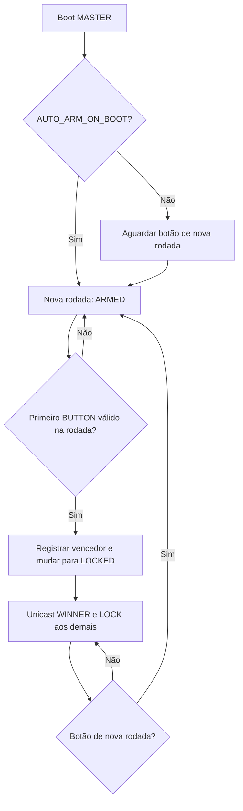
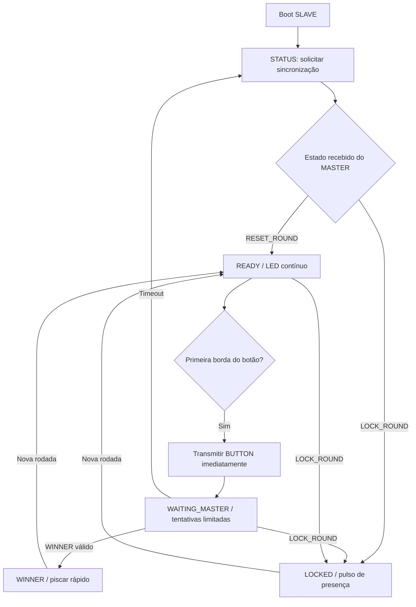

# QuizBuzzer ESP-NOW

Firmware **QuizBuzzer-ESP32-ESPNow**, em C++ com **ESP-IDF SDK v6.x**, validado na compilação com **v6.0.2**, para nove bancadas de perguntas e respostas: um MASTER e oito SLAVES. Alvo inicial: ESP32 clássico, módulo ESP32-WROOM-32, flash de 4 MB. Usa CMake e APIs nativas do ESP-IDF.

O MASTER aceita o primeiro `BUTTON_PRESSED` válido recebido na rodada, registra o vencedor e trava a disputa antes de qualquer envio ou log. Somente sua confirmação `WINNER` permite ao SLAVE sinalizar vitória. O botão de nova rodada do MASTER limpa o resultado e libera outra disputa.

> Antes de usar: substitua os nove MACs fictícios em [src/device_config.cpp](src/device_config.cpp) e confirme os GPIOs em [include/pins.h](include/pins.h). O firmware imprime o MAC local e permanece em erro se a identidade não corresponder à configuração.

## Arquitetura e firmware único

Todas as placas recebem o mesmo binário. Um jumper lido no boot define a função:

| Entrada `ROLE_SELECT_PIN` | Função | ID |
| --- | --- | --- |
| LOW, ligado ao GND | MASTER | 0 |
| HIGH, aberto com pull-up | SLAVE | 1 a 8, localizado pelo MAC |

`ConfigDeviceIdProvider` consulta a tabela compartilhada de MACs; `CONFIGURED_SLAVE_ID=0` ativa essa seleção automática. A alternativa de ID fixo e a extensão para DIP switch, jumpers ou NVS estão descritas em [configuração](docs/configuracao.md).

Uma única tarefa `quiz_game` controla o estado da placa. Os callbacks ESP-NOW validam e copiam pacotes para uma fila FIFO, sem alterar a rodada. Uma ISR de GPIO acorda a tarefa do jogo, que detecta a primeira borda e tenta transmitir imediatamente. Debounce, retransmissões e supervisão usam contadores de tempo locais; esses tempos nunca comparam participantes.

LEDs e saída serial têm tarefas próprias de baixa prioridade. O caminho de acionamento não grava flash, não faz animações e não espera debounce. As esperas FreeRTOS cedem a CPU e são interrompidas por eventos; não há `delay()` nem espera ativa.

```text
include/                  Configuração, interfaces e tipos
src/                      Implementações e app_main()
main/CMakeLists.txt       Entrada do projeto ESP-IDF
components/quiz_core/     Protocolo e lógica, independentes do hardware
components/quiz_hardware/ ESP-NOW, GPIO, NVS e logs assíncronos
docs/                     Protocolo, hardware, estados, configuração e testes
tests/firmware/           Aplicação Unity para ESP32/QEMU
tools/run_qemu_tests.py   Executor dos testes em emulação
```

## Funcionamento

1. O MASTER inicia a rodada 1 se `AUTO_ARM_ON_BOOT=true`; caso contrário, aguarda o botão de nova rodada.
2. Cada SLAVE anuncia seu boot com `STATUS`. O MASTER responde por unicast com o estado atual e o SLAVE confirma com `ACK`.
3. Após `RESET_ROUND`, o SLAVE fica READY. A primeira borda de seu botão gera um pacote de 42 bytes, sem aguardar os 30 ms do debounce.
4. O primeiro pacote válido aceito pelo MASTER define o vencedor. Ele envia `WINNER` ao vencedor e `LOCK_ROUND` aos demais.
5. Novos acionamentos não alteram o resultado. O botão do MASTER incrementa `roundID` e inicia outra rodada.

O participante precisa soltar o botão para voltar a disparar. Um botão mantido durante boot ou mudança de rodada não produz um novo acionamento. O botão do MASTER é uma entrada de jogo; não é o pino EN de reset do ESP32.





O retorno via sincronização após timeout preserva o bloqueio de acionamento da mesma rodada. Um SLAVE nunca se declara vencedor por timeout ou por confirmação de entrega do rádio.

## ESP-NOW e igualdade entre bancadas

Wi-Fi em modo **STA**, canal fixo 6 por padrão, economia de energia desabilitada, sem Access Point, associação ou roteador. O MASTER cadastra oito peers e cada SLAVE cadastra o MASTER. Todos os comandos são unicast, incluindo o RESET individual aos oito destinos, com confirmação lógica por bancada.

Os oito SLAVES usam a mesma rotina, debounce, tamanho de pacote, canal e política de retransmissão. Não há prioridade de participante por ID. A ordenação de distribuição de estados e de supervisão não participa da arbitragem.

A regra é **primeiro pacote válido recebido e aceito**, não o menor tempo físico de pressão. Interferência, colisões, perdas e a ocupação do rádio afetam a chegada. O envio crítico tem prioridade sobre trabalho de supervisão pendente; uma transmissão já em voo não pode ser interrompida. Valide a latência no hardware definitivo, inclusive durante a liberação da rodada.

## Pinagem inicial

| Sinal | GPIO | Ligação |
| --- | ---: | --- |
| `ROLE_SELECT_PIN` | 27 | Pull-up; jumper para GND seleciona MASTER |
| `SLAVE_BUTTON_PIN` | 25 | Botão normalmente aberto para GND |
| `SLAVE_LED_PIN` | 26 | Saída ativa em HIGH para estágio de acionamento |
| `MASTER_RESET_BUTTON_PIN` | 33 | Botão normalmente aberto para GND |

Essa pinagem é provisória e específica do ESP32 clássico. Os GPIOs usam lógica de 3,3 V. LEDs de botões de 5/12 V precisam de estágio de acionamento; consulte [hardware](docs/hardware.md) antes de conectar.

## Obter e configurar os MACs

1. Abra um terminal ESP-IDF **6.x**, compile e grave inicialmente o firmware em cada placa.
2. Abra o monitor em 115200 baud. Reinicie a placa para capturar a identificação:

   ```text
   [I] QuizBuzzer ESP-NOW / ESP-IDF 6.x
   [I] MAC local: XX:XX:XX:XX:XX:XX
   [I] Funcao: SLAVE; ID: 255
   ```

3. O ID 255 significa MAC ainda não cadastrado. A sinalização de erro nessa etapa é esperada.
4. Substitua todos os valores `02:00:00:00:00:10` a `02:00:00:00:00:18` em `DEVICES`. Use o **MAC STA**, sem trocar o MAC de fábrica.
5. Compile novamente e grave o mesmo firmware atualizado nas nove placas.
6. Coloque o jumper de MASTER em uma única placa, com o sistema desligado. Reinicie todas e confira IDs, canal e mensagens ONLINE.

O MASTER precisa ter exatamente o MAC da entrada 0. O ID fixo, se utilizado, também é validado contra o MAC correspondente. Não use a tabela fictícia para um jogo.

## Compilação e gravação

Pré-requisito: ambiente ESP-IDF SDK v6.x ativado, com compilador Xtensa e dependências instalados. Não há bibliotecas externas de aplicação para baixar.

```sh
idf.py --version
idf.py set-target esp32
idf.py build
idf.py -p COM5 flash monitor
```

Troque `COM5` pela porta real; no Linux, por exemplo, `/dev/ttyUSB0`. Saia do monitor com `Ctrl+]`. O comando `set-target` é para a primeira configuração ou mudança de chip, pois recria a configuração de build. Nas compilações seguintes, use `idf.py build`.

Arquivos gerados: `build/QuizBuzzer-ESP32-ESPNow.bin`, bootloader, tabela de partições e ELF para depuração. `idf.py flash` grava o conjunto com os offsets apropriados. A flash padrão é 4 MB, com partição de aplicação de 1 MB. Confirme a capacidade real da sua placa em `idf.py menuconfig`.

O código exige a série **6.x** e usa as assinaturas de callback dessa série: recepção com `esp_now_recv_info_t`, envio com `esp_now_send_info_t`. As configurações do jogo ficam em [config.h](include/config.h); configurações do SDK ficam em `sdkconfig.defaults`/`menuconfig`.

## LEDs

| Estado SLAVE | Padrão |
| --- | --- |
| Inicialização / sincronização | Alterna a cada 150 ms |
| READY | Aceso contínuo |
| WAITING_MASTER | Alterna a cada 300 ms |
| WINNER | Alterna a cada 100 ms |
| LOCKED | Pulso de 80 ms a cada 2 s |
| Erro de inicialização/radio | Dois pulsos curtos a cada 2 s |

No MASTER, o mesmo LED fica contínuo em ARMED e pulsa quando a rodada está bloqueada ou aguardando liberação. Os padrões são configuráveis. A indicação WINNER permanece até nova rodada, mesmo se houver perda de comunicação.

## Protocolo e recuperação

O [protocolo completo](docs/protocolo.md) define `BUTTON_PRESSED`, `WINNER`, `RESET_ROUND`, `LOCK_ROUND`, `ACK`, `PING` e `STATUS`, com versão, CRC, IDs, sequência e identidade completa da rodada. Frames desconhecidos, MAC/ID incompatível, destino errado, sessão/rodada antiga e duplicatas são rejeitados.

`RESET_ROUND`, `LOCK_ROUND` e `WINNER` são repetidos até ACK: inicialmente a cada 80 ms, depois a cada 1 s. Cada nova transmissão tem sequência própria. `BUTTON_PRESSED` tem até seis tentativas, espaçadas em 40 ms. Sem decisão em 1,2 s, o SLAVE solicita sincronização e continua impedido de acionar novamente naquela rodada. O MASTER mantém o resultado mesmo sem receber ACK de WINNER.

O contador NVS de boot é gravado uma vez por inicialização. O caminho de jogo não escreve na flash. Erros de NVS não causam apagamento automático; consulte [procedimento de manutenção](docs/configuracao.md#nvs-e-reinicializações).

## Testes

Há uma aplicação Unity que executa o mesmo núcleo C++ do firmware, com transporte controlado para injetar perdas, duplicatas e mensagens fora de ordem. Compilação e execução:

```sh
idf.py -C tests/firmware build
python tools/run_qemu_tests.py
```

O segundo comando exige o QEMU Xtensa da Espressif no PATH. Alternativamente, execute os testes em uma placa com `idf.py -C tests/firmware -p COM5 flash monitor`; isso substitui o firmware da placa pela aplicação de testes. A estratégia, cenários físicos obrigatórios e limites da emulação estão em [docs/testes.md](docs/testes.md).

## Solução de problemas

| Sintoma | Verificação |
| --- | --- |
| ID 255 / erro de identidade | MAC STA ausente na tabela; confira `DEVICES` e regrave todas as placas |
| MASTER aparece como SLAVE | Jumper GPIO27-GND, terra comum local e leitura no boot |
| Nenhum SLAVE fica READY | Canal, MAC do MASTER, tabela idêntica e botão de liberação se auto-arm desativado |
| SLAVE fica WAITING_MASTER | Veja alimentação, alcance, canal e logs ONLINE/OFFLINE; aguarde sincronização |
| MASTER registra vencedor, LED demora | WINNER/ACK perdidos; retries mantêm o resultado; verifique o enlace |
| Botão mantido não dispara novamente | Comportamento intencional: solte por pelo menos 30 ms e aguarde nova rodada |
| READY demora após RESET | RESET é confirmado por unicast; uma placa offline não bloqueia as demais |
| LED sempre invertido | Ajuste `LED_ACTIVE_HIGH` conforme transistor/driver |
| Erro NVS | Não apague automaticamente; siga manutenção documentada |
| Timeout de callback do rádio | Firmware entra em erro; revise alimentação/enlace e reinicie a placa |
| Erro de compilação em callback | Confirme ESP-IDF 6.x e reconfigure com essa instalação |

`VERBOSE_DEBUG_ENABLED=true` imprime contadores de RX inválido/descartado, sucesso/falha de rádio e erros de envio. ONLINE confirma tráfego recente, não confirma que o LED foi observado nem que toda a rodada chegou a todos os participantes.

## Expansões

Seleção por DIP/NVS, display no MASTER, painel de supervisão, configuração persistente de MACs, provisionamento, CCMP com chaves por peer e atualização OTA podem ser adicionados pelos módulos existentes. Ampliar `MAX_SLAVES` exige ampliar a tabela e revisar capacidade de peers, intervalos e testes. A base atual não implementa criptografia nem autenticação contra falsificação de MAC.

Referências de APIs: [ESP-NOW no ESP-IDF 6.0](https://docs.espressif.com/projects/esp-idf/en/v6.0/esp32/api-reference/network/esp_now.html) e [repositório oficial ESP-IDF](https://github.com/espressif/esp-idf). Licença [MIT](LICENSE).
